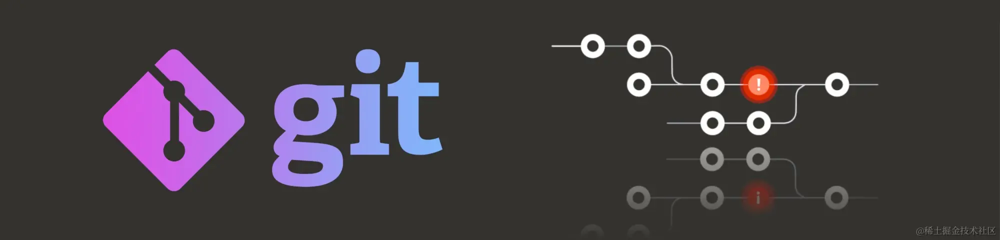
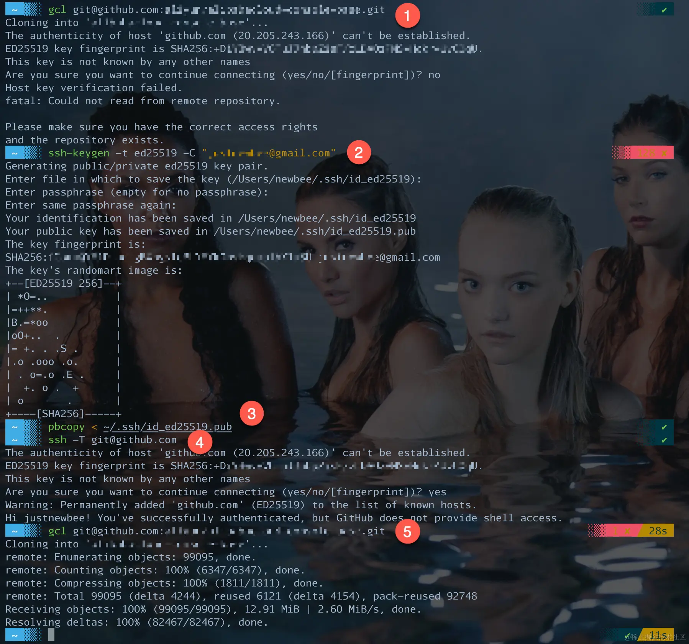
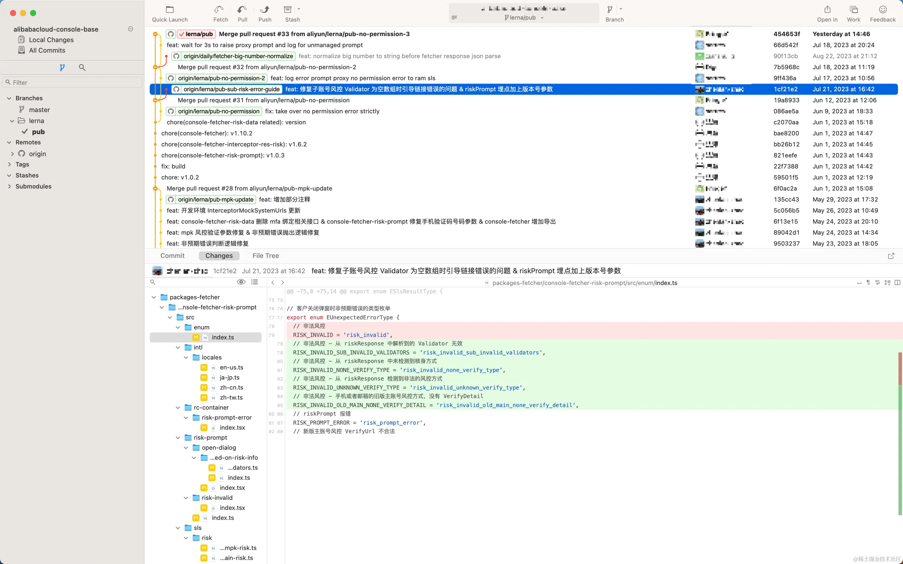
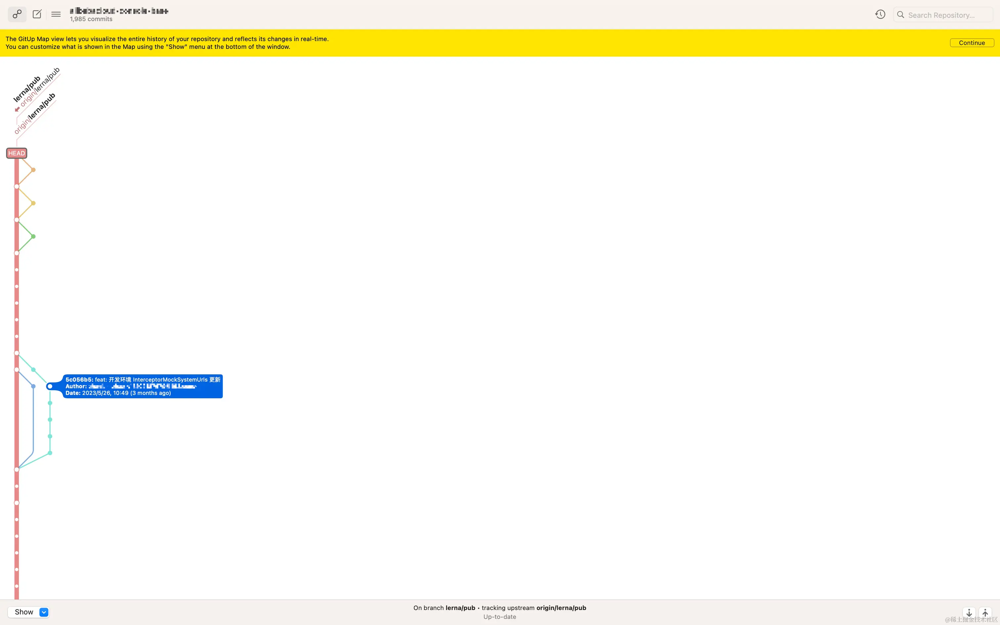
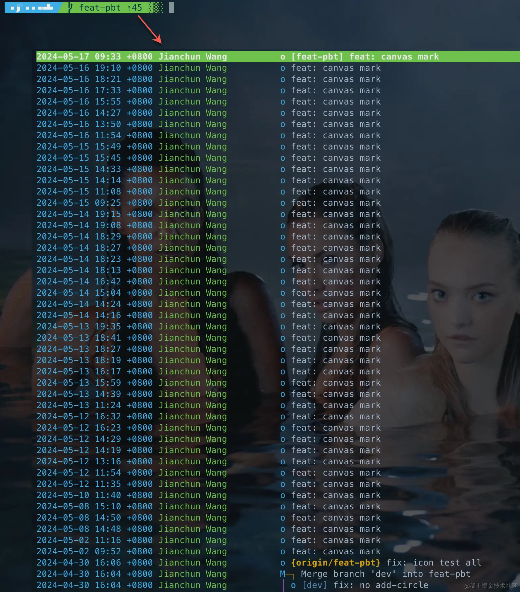

# 入坑 Git，看这一篇就够了 - 掘金

---

* 入坑 Git，看这一篇就够了 - 掘金
* [https://juejin.cn/post/7289661061993005093](https://juejin.cn/post/7289661061993005093)
* 你可以不懂 Git 背后的实现原理，你可以不了解它所有的功能，但你一定要会用命令行，一定要知道除了 add、commit、push 之外的常用命令。听话，不要只会用 GUI。
* 2024-05-18 16:13:18

---

​​

## 🎼 前言

最近在网上刷到了电视剧中「神级」伪程序员的骚操作，就是通过「秋秋」把代码发给老板，吐槽者就说：「天哪，这么弔的程序员（盲敲键盘、用 Word 写代码并且还能运行）居然不用 Git...」

现实中，没有程序员不用 Git 没错吧？但又有多少人只停留在只会 GUI 操作上？

本文将以作者对 Git 的浅薄了解，带你入坑 Git（断断续续连着写了一个月）。

## TL;DR

你可以不懂 Git 背后的实现原理，你可以不了解它所有的功能，但你一定要会用命令行，一定要知道除了 `add`​、`commit`​、`push`​ 之外还有别的常用命令。

## 主要内容

​​

## 适合读者

* 想要了解 Git 的新人
* 只会用 GUI 工具的同学

## 你将获得

1. Git 的基本概念
2. Git 的安装与基本设置
3. Git 客户端（纯文本、GUI、系统集成、插件）
4. 多用命令行，以及哪些常用命令，而不要强依赖 GUI（除了 Merge 推荐 JetBrains 之外）
5. 一些小技巧

## 编辑历史

|日期|版本说明|
| ------------| ----------------------------------------|
|2024/05/17|V2，新增《不常用，但很有用的技巧》章节|
|2023/10/15|V1|

## 🧬 Git 简介

[Git](https://git-scm.com/ "https://git-scm.com") 是 [Linus Torvalds](https://baike.baidu.com/item/%E6%9E%97%E7%BA%B3%E6%96%AF%C2%B7%E6%9C%AC%E7%BA%B3%E7%AC%AC%E5%85%8B%E7%89%B9%C2%B7%E6%89%98%E7%93%A6%E5%85%B9/1034429 "https://baike.baidu.com/item/%E6%9E%97%E7%BA%B3%E6%96%AF%C2%B7%E6%9C%AC%E7%BA%B3%E7%AC%AC%E5%85%8B%E7%89%B9%C2%B7%E6%89%98%E7%93%A6%E5%85%B9/1034429") 为了帮助管理 Linux 内核开发而开发的版本控制系统（Version Control System，以下简称 VCS），和传统集中式如 CVS、SVN 不同，Git 的特点是分布式，不一不必依赖远程服务器。

## 三个主要功能

作为分布式版本控制系统，Git 的主要功能包括：

1. ​**版本控制**​：跟踪和管理代码的版本，方便开发人员对代码进行版本控制和回溯
2. ​**分支管理**​：开发人员可以在不同的分支上进行开发，并在需要时合并分支
3. ​**分布式协作**​：Git 特点是分布式加云端同步，方便开发者在不同设备上进行开发和协作

## 四个空间

​​

* ​**Working Tree（工作区）** ​：即文件目录，存放所有已跟踪、未跟踪、已提交、未提交的文件
* ​**Index（暂存区，又叫 Stage）** ​：存放临时（待提交）的改动，它实际上是一个二进制文件 `.git/index`​
* ​**Local Repository（本地仓库）** ​：「临时」的安全数据存放区域
* ​**Remote Repository（远程仓库）** ​：真正安全的数据存放区域，托管代码的服务器，最著名的就是 [GitHub](https://github.com/ "https://github.com")，公司都会自建服务器（多数用 GitLab），当然我们自己也可以自建服务器玩玩

其中「本地仓库」是 Git 作为「分布式」版本控制软件的关键。

## 四种文件状态

|状态|说明|图示|
| -----------| ------------------------------------------------------------------| ---------------------------------------------------------------------------------------------------------------|
|Untracked|新增的文件，仅存在于 Working Tree|​​|
|New file|Untracked 文件在`git add`​后的状态，待`git commit`​进入本地仓库，或`git restore --staged <file>`​重回 Untracked|​​|
|Modified|已登记在案（在本地仓库中或者在暂存库中）的文件最近又发生了改动|​​|
|Staged|已暂存，尚未提交，`git add`​后的文件状态，`git restore --staged <file>`​返回之前的状态|​​|
|Committed|​`git commit`​后的文件状态|​​|

说明一下：

1. 图示中表示状态的颜色，绿色表示「已暂存」，红色表示「未暂存」
2. 图示中 Powerline 状态（来自 [powerlevel10k](https://github.com/romkatv/powerlevel10k#oh-my-zsh "https://github.com/romkatv/powerlevel10k#oh-my-zsh")），`?`​ 表示 「Untracked 文件数」，`+`​ 表示「已暂存文件数」，`!`​ 表示「未暂文件数」
3. 需要注意的是，「Untracked」一定「未暂存」，「New file」一定「已暂存」，「Modified」则有「已暂存的 Modified」和「未暂存的 Modified」两种（其实我认为可以把 Untracked 视为一种特殊的 New file 更好理解）

另外，我没有找到 `git push`​ 之后文件的状态，难道是「remotely tracked」？但由于 Git 是一个分布式的 VCS，可能这就不是很重要吧。

## 三个基本操作（三板斧）

上图同时也体现了 Git 几个工作区之间的状态流转所用到的关键命令，同集中式 CVS 的一次 commit 不同，Git 需要经历 `add`​ → `commit`​ → `push`​ 三步，也就是被戏称为 Git 三板斧的三个基本操作。

这对当时经历 SVN 到 Git 迁移的程序员来说，闹出过不少笑话。记得当时有位老兄是这么说的：「在 Git，就像对女朋友一样，你不能只是『承诺』，那没用，必须『推到』，那才是真的有用。」

1. ​`git add`​：将文件的改动添加到暂存区
2. ​`git commit`​：将暂存区的改动，提交到本地仓库
3. ​`git push`​：将本地仓库的当前分支，提交到远程仓库对应的分支

注意，这三板斧是一个链式的线性操作。

## 五种 URL 协议

|格式|例子|优点|缺点|适用场景|
| -----------------| --------------| ---------------------------------------------------------------------------------------------------| ----------------------------------------------| -----------------------------|
|HTTP/HTTPS 协议|​`https://github.com/user/repo.git`​|简单易用|传输速度较慢；私有仓库，可能需要用户名和密码|大多数场景|
|SSH 协议|​`git@github.com:user/repo.git`​|安全可靠|设置相对较复杂|需要频繁进行 Git 操作的场景|
|Git 协议|​`git://github.com/user/repo.git`​|速度快、安全性高（比 HTTP/HTTPS 和 SSH 协议具有更快的传输速度，并且不需要对外暴露仓库的读写权限）|不适用于排除防火墙的企业环境|-|
|文件路径|​`/path/to/repository.git`​|无网络传输，速度非常快|仅适用于本地操作|开发和测试环境|
|子模块 URL|任何以上格式|非常灵活（子模块 URL 可以指向任何 Git 仓库）|对于代码维护来说并不利|代码复用和模块化开发|

## .git 目录

Git 的所有信息都在 `.git`​ 目录下，我们看一下它下面有些什么：

​​

|名称|类型|说明|
| ------| ------------| ---------------------------------------------------------------------------------------|
|​`COMMIT_EDITMSG`​|文本文件|保存着最近一次的提交信息，作用仅仅只是给用户一个参考|
|​`HEAD`​|文本文件|记录了当前分支的指向|
|​`config`​|文本文件|当前仓库的本地配置，会与全局的进行合并，本地的同名配置优先|
|​`description`​|文本文件|项目描述（但我看不懂它的来源和作用）|
|​`hooks`​|目录|默认只有一堆钩子的 sample 文件|
|​`index`​|二进制文件|暂存区|
|​`info`​|目录|默认只有一个`exclude`​文件|
|​`logs`​|目录|操作记录，包含文件`HEAD`​（就是`git reflog`​来源）、`refs/heads`​目录、`refs/remotes`​目录|
|​`objects`​|目录|存放所有的 Git 对象，哈希值一共 40 位，前 2 位作为文件夹名称，后 38 位作为对象文件名|
|​`tags`​|目录|存储 Git 各种引用，包含三个目录`heads`​（所有的本地分支）、`tags`​（所有的本地 Tag）、`remotes`​下只有`origin/HEAD`​|

## 🕋 安装与设置

## 安装

你拿到 Mac 后，可能已经预装好了 Apple Git：

​​

一般比 [官方版本](https://git-scm.com/downloads "https://git-scm.com/downloads") 的要低，想要安装最新版的，用 [homebrew](https://brew.sh/ "https://brew.sh") 安装：

```bash
brew install git
```

> 但也可能没有 Apple Git，而 homebrew 自己的安装又需要用到 `git`​，事情就变成「安装 git 需要现有 git」的尴尬场面，可以按照提示先安装命令行工具。

安装后，重启 Terminal，即可看到安装了最新版的 `git`​：

1. ​`git -v`​ 看到的是 Apple 预装的 `2.39.2`​
2. ​`which git`​ 显示位置为  **/user/bin/git**
3. ​`brew install git`​ 安装官方 Git
4. ​`git -v`​ 看到的仍是原来的 Apple Git
5. 重启 Terminal 后，`git -v`​ 看到的是新装版本
6. ​`which git`​ 显示位置为  **/opt/homebrew/bin/git**

​​

想要重新用回 Apple Git，`brew uninstall git`​；临时用回 Apple Git，可以用全路径 `/usr/bin/git`​。

## 设置

### SSH

使用 SSH 协议进行 Git 操作，安全可靠，速度相对较快，需要配置 SSH 密钥，同时需要在 Git 服务器（GitHub 或 GitLab 等）上添加对应的公钥。

一般在设置页面上链有说明文档，完全不必担心怎么设置。

以 Mac + GitHub 为例：

1. ​`gcl git@...`​尝试 clone SSH Url，失败
2. ​`ssh-keygen -t ed25519 -C "em@il"`​ 生成跟邮箱对应的 SSH Key
3. ​`pbcopy < ~/.ssh/id_ed25519.pub`​ 拷贝公钥内容至剪贴板，去 GitHub **Settings** → **SSH and GPG Keys** → **New SSH** 黏贴
4. ​`ssh -T git@github.com`​ 测试（可以跳过）
5. 再次 clone，成功

​​

### 用户名和邮箱

Git 会在适当的时候提示你，比如当你需要提交代码的时候，它才会问你要账号信息：

​​

大部分公司的 Git 规范一般都会要求用公司的邮箱，因此预先设置用户名和邮箱尤为重要：

```bash
git config --global user.name 我是谁
git config --global user.email em@li.com
```

### 主分支名

Apple Git 的主分支名为 `main`​，Github 也已经把主分支名改成了 `main`​，但官方的 Git 在 `git init`​ 的时候还会有警告：

​​

按它的说明改一下：

```bash
git config --global init.defaultBranch main
```

### 全局 Ignore

Git 仓库一定会有 `.gitignore`​，但那应当仅限于操作系统自动生成的文件、构建和单测产物等等。

我们也可以增加「全局 Ignore」 `~/.gitignore_global`​，比如临时存放只有自己会用的一些文件，不想删，不想挪位置，不想提交。

比如我有一些通用的模板代码放在某个目录下，然后软链接进来；又或者经常性地，我会将「临时」删除的文件 `mv`​ 到某个格式的目录下，最后再一起「硬」删除。

我的习惯是一定忽略四个连续 `_`​ 打头的文件或目录，如下操作：

```bash
cd ~
touch .gitignore_global
echo "____*" > .gitignore_global
git config --global core.excludesFile ~/.gitignore_global
```

## Config 概览

以上所有的全局配置都存入 ​ **~/.gitconfig**​，可以直接看文件内容，也可以敲命令 `git config --list --global`​ 查看。

​​

​​

在 Git 本地仓库下的 `.git/config`​ 中存着当前仓库的设置信息，Git 读取配置（`git config --list`​）会与全局的进行合并。

## 🖲 Git 客户端

这里列数了我在用和浅尝过的一些客户端工具，更多可以看官方的文档 [《GUI Clients》](https://git-scm.com/downloads/guis "https://git-scm.com/downloads/guis")。

## 纯文本客户端

### tig ★★★★★

​​

名字取得好，看 Git 信息必备，我最常用的 Git 工具。

* URL：[jonas.github.io/tig](https://jonas.github.io/tig "https://jonas.github.io/tig")
* 平台：Mac / Linux
* 安装：`brew install tig`​
* 推荐指数：★★★★★

### lazygit ★★★★★

​​

Github 39K Star；全功能 Git 客户端。

* URL：[github.com/jesseduffie…](https://github.com/jesseduffield/lazygit "https://github.com/jesseduffield/lazygit") 39K Star
* 平台：Mac / Linux
* 安装：`brew install lazygit`​
* 推荐指数：★★★★★

### gitui ★★☆

​​

> 注意不是 `git-gui`​。

比较专注于待提交，不支持鼠标事件是个遗憾。

* URL：[github.com/extrawurst/…](https://github.com/extrawurst/gitui "https://github.com/extrawurst/gitui") 14.1K Star
* 免费
* 平台：Mac / Linux
* 安装：`brew install gitui`​
* 推荐指数：★★☆

## GUI 客户端

> 珍爱生命，少用 GUI。

### GitKraken ★★★★☆

​​

号称「The world's most powerful suite of Git tools」，界面确实好看，功能也确实不错。

免费版的不能用在企业自搭的 GitLab 或 BitBucket，会要求升级账号（要钱）。

* URL：[www.gitkraken.com](https://www.gitkraken.com/ "https://www.gitkraken.com")
* 收费：个人版免费；Pro 版 \$4.95/月；Team ban \$8.95/人月；企业版 \$18.95/人月
* 平台：Mac / Windows / Linux
* 安装：下载安装
* 推荐指数：★★★★☆

### SourceTree ★★★★

​​

免费的全功能 Git 客户端，UI 设计还不错。

* URL：[www.sourcetreeapp.com](https://link.juejin.cn/?target=https%3A%2F%2Fwww.sourcetreeapp.com "https://www.sourcetreeapp.com")
* 免费
* 平台：Mac / Windows
* 安装：下载安装
* 推荐指数：★★★★

### Tower ★★★★

​​

跟 SourceTree 有点像，但个人感觉 Tower 更好看一些。

* URL：[www.git-tower.com](https://www.git-tower.com/ "https://www.git-tower.com")
* 收费：基础版 \$69；Pro 版 \$99；学生和教师可获取免费 License
* 平台：Mac / Windows
* 安装：下载安装
* 推荐指数：★★★★

### SublimeMerge ★★★

​​

Sublime 作者出品，必属精品；但是一些基础的功能，比如切换主题，也需要收费。

* URL：[www.sublimemerge.com](https://www.sublimemerge.com/ "https://www.sublimemerge.com")
* 收费：\$99
* 平台：Mac / Windows / Linux
* 安装：下载安装
* 推荐指数：★★★

### Fork ★★☆

​​

和免费的 SourceTree 非常像，所以还是用 SourceTree 吧。

* URL：[git-fork.com](https://git-fork.com/ "https://git-fork.com")
* 收费：\$49.99
* 平台：Mac / Windows / Linux
* 安装：下载安装
* 推荐指数：★★☆

### SmartGit ★★☆

​​

师出名门，就是感觉性能..不能尽如人意。

* URL：[www.syntevo.com/smartgit](https://www.syntevo.com/smartgit "https://www.syntevo.com/smartgit")
* 收费：\$5.90/Month
* 平台：Mac / Windows / Linux
* 安装：下载安装
* 推荐指数：★★☆

### GitUp ★★★☆

​​

还蛮..特别的，关注在提交历史和版本计较的体验上。

* URL：[github.com/git-up/GitU…](https://github.com/git-up/GitUp "https://github.com/git-up/GitUp")
* 免费
* 平台：Mac
* 安装：下载安装
* 推荐指数：★★★☆

### 其他

另外还有好多好多，没有一一试用，简单罗列一下：

* [git-it](https://github.com/jlord/git-it-electron "https://github.com/jlord/git-it-electron")
* [Gitfox](https://www.gitfox.app/ "https://www.gitfox.app")
* [GitBlade](https://gitblade.com/ "https://gitblade.com")
* [GitX](https://github.com/gitx/gitx "https://github.com/gitx/gitx")
* [Gittyup](https://github.com/Murmele/Gittyup "https://github.com/Murmele/Gittyup")

## 系统集成

### GitFinder ★★☆

​​

未曾试用，喜欢类似 TortoiseGit 体验的同学可以试试。

但 Mac 系统有 `.DS_Store`​，我并不喜欢用 Finder 看开发目录。

* URL：[gitfinder.com](https://gitfinder.com/ "https://gitfinder.com")
* 收费：\$29.95
* 平台：Mac
* 安装：下载安装
* 推荐指数：★★☆

### TortoiseGit ★★★★

​​

用过它的两个兄长 TortoiseCVS 和 TortoiseSVN，Windows 用户值得拥有。

* URL：[tortoisegit.org](https://tortoisegit.org/ "https://tortoisegit.org")
* 免费
* 平台：Windows
* 安装：下载安装
* 推荐指数：★★★★

## 插件

IDE 或编辑器的 Git 插件应该是用的最多的 Git 客户端了吧。

### JetBrains 家族 ★★★★★

JB 的 Git 体验是我用过最棒的，直观的修改状态提示（文件树和编辑器）、方便的快捷键、丰富的菜单项、无与伦比的 Diff Merge，正是它的 Git 体验，让我毫不犹豫地弃 Eclipse 而改投 WebStorm 的怀抱。

即使通常使用命令行进行大部分的 Git 操作，在遇到需要人肉 Merge 的时候，我一定会用 JB 的 Git。

* URL：-
* 收费：IDE 内置插件
* 平台：Mac / Linux / Windows
* 安装：IDE 内置
* 推荐指数：★★★★★

### VSCode - GitLens ★★★★★

VSCode 下操作 Git 不二之选。

* URL：[marketplace.visualstudio.com/items?itemN…](https://marketplace.visualstudio.com/items?itemName=eamodio.gitlens "https://marketplace.visualstudio.com/items?itemName=eamodio.gitlens")
* 免费
* 平台：Mac / Linux / Windows
* 安装：插件市场
* 推荐指数：★★★★★

### Eclipse - EGit ★★★

Eclipse 内置插件，喜欢 Eclipse 一定会用它，但体验真的没有 JB 家族的好。

* URL：[eclipse.dev/egit](https://eclipse.dev/egit "https://eclipse.dev/egit")
* 免费
* 平台：Mac / Linux / Windows
* 安装：IDE 内置
* 推荐指数：★★★

## 汇总

纯文本 UI 推荐 `tig`​ 和 `lazygit`​；标准 GUI 客户端推荐 GitKraken 和 SourceTree；系统集成看个人喜好吧；IDE 推荐 JB 家族和 VSCode 的 GitLens。

## 🚥 命令行

> 珍爱生命，多用命令行。不要只用 GUI，不要只会「三板斧」。

GUI 工具固然方便，优秀的程序员更应该对 Git 常用命令了如指掌。

## OMZ & Fig

说到命令行，又不得不提 [Oh My Zsh](https://github.com/ohmyzsh/ohmyzsh "https://github.com/ohmyzsh/ohmyzsh") 和 [Fig](https://fig.io/ "https://fig.io")。

OMZ 的 [Git 插件](https://github.com/ohmyzsh/ohmyzsh/tree/master/plugins/git "https://github.com/ohmyzsh/ohmyzsh/tree/master/plugins/git") 提供了近 200 个简化命令别名，能够极大地提升效率。

Fig 能够为正在输入的命令及参数提供直观友好的提示，是了解命令及参数的最好老师：

​​

## 仓库操作

|操作|命令|OMZ 短名|
| ----------------------| ------| ----------|
|初始化|​`git init`​|-|
|克隆|​`git clone <url>`​|​`gcl`​|
|配置（仅对当前仓库）|​`git config`​|-|
|获取当前仓库配置信息|​`git config --list`​|​`gcf`​|
|添加远程|​`git remote add <name> <url>`​|​`gra <name> <url>`​|
|设置远程|​`git remote set-url <name> <url>`​|​`grset <name> <url>`​|
|移除远程|​`git remote rm <name>`​|​`grrm <name>`​|
|更名远程|​`git remote rename <from> <to>`​|​`grmv <from> <to>`​|

## 分支操作

|操作|命令|OMZ 短名|
| ------------------------------------------------------| --------------------| ----------|
|查看本地分支列表|​`git branch`​|​`gb`​|
|查看远程分支列表|​`git branch -r`​|​`gbr`​|
|查看本地 + 远程分支列表|​`git branch -a`​|​`gba`​|
|新切分支|​`git checkout -b <branch>`​|​`gcb <branch>`​|
|切换分支|​`git checkout <branch>`​|​`gco <branch>`​|
|新切分支 2|​`git switch -c <branch>`​|​`gswc <branch>`​|
|切换分支2|​`git switch <branch>`​|​`gsw <branch>`​|
|切回主分支|​`git checkout <main-branch>`​需分清`main`​还是`master`​|​`gcm`​|
|切回主分支 2|​`git switch <main-branch>`​需分清`main`​还是`master`​|​`gswm`​|
|重命名分支|​`git branch -m <branch>`​|​`gbm <branch>`​|
|删除分支|​`git branch -d <branch>`​|​`gbd <branch>`​|
|删除分支（强删）|​`git branch -D <branch>`​|​`gbD <branch>`​|
|清除本地残留的远程分支记录（否则命令行提示会干扰`git checkout`​）|​`git remote prune origin`​|-|
|合并主分支|​`git merge master 或 main`​|​`gmom`​|

## 变更操作

|操作|命令|OMZ 短名|
| ----------------------------------| ------| --------------------------|
|从远程仓库下载最新变更至本地仓库|​`git fetch`​|​`gf`​|
|​`git fetch`​之前清理残留的远程分支记录|​`git fetch --all --prune`​|​`gfa`​|
|从远程仓库拉取并合并|​`git pull`​|​`gl`​|
|合并分支|​`git merge <branch>`​|​`gm <branch>`​|
|进 Stage|​`git add`​|​`ga`​|
|提交|​`git commit -m <message>`​|​`gcmsg`​|
|进 State + 提交一步到位|​`git commit -am <message>`​|​`gcam`​|
|推到远程仓库（需新建远程分支）|​`git push -u origin <branch>`​|​`gpsup`​可以自感知当前分支名|
|推到远程仓库（已有远程分支）|​`git push`​|​`gp`​|

## 文件操作

|操作|命令|OMZ 短名|
| ----------------| ------| ----------|
|删除文件或目录|​`git rm <file>`​|​`grm <file>`​|
|移动文件或目录|​`git mv <from> <to>`​|-|

## 查看信息

|操作|命令|OMZ 短名|
| ------------------------------------------------------| ------| ----------|
|打印远程信息|​`git remote -v`​|​`grv`​|
|查看工作目录的状态（那些文件有改动、哪些文件未跟踪）|​`git status`​|​`gst`​|
|查看 Commit 之间的文件内容差异|​`git diff`​|​`gd`​|
|查看提交日志|​`git log`​|-|

OMZ 提供了一系列显示效果更好的日志查看便捷命令，推荐 `glol`​、`glola`​，比如 `glol`​ 的效果：

​​

## 后悔药

|操作|命令|OMZ 短名|
| --------------------| ----------| ----------|
|重置 HEAD 指针|​`git reset`​|​`grh`​|
|回滚|​`git revert <commit>`​|​`grev`​|
|删除远程分支 / Tag|​`git push -d origin <branch>`​或`git push origin :<branch>`​|​`gpod <branch>`​|

## 其他

|操作|命令|OMZ 短名|
| ---------------| ------| ----------|
|查看 Tag 列表|​`git tag`​|-|
|新建 Tag|​`git tag <name>`​|-|
|推送 Tag|​`git push <tag-name>`​|-|

## 🗿 不常用，但非常有用的技巧

## 修改提交者信息

公司要求提交信息是公司的邮箱，但你可能有自己的开源项目，如果忘记设置 `user.name`​ 和 `user.email`​ 就会产生不合场景的提交信息。

如果公司的 Git 服务设置禁止非公司域邮箱提交，最终可能导致无法 push。

也有可能你在自己的私人项目下以公司邮箱的身份提交了。

### 修改最近一次 commit 作者

提交一次即刻觉醒，及时止损。

​​

修正当前项目（非全局）下的用户信息（也可以直接编辑 `.git/config`​）：

```bash
git config user.name <用户名>
git config user.email <私人邮箱>
```

然后执行 `git commit --amend --reset-author`​ 即可：

​​

### 修改多次 Commit 作者

但更多的时候可能是，已经错误提交了很多次，在最终 `push`​ 的时候被远程拒绝了。

参考文档：[dev.to/brayanarrie…](https://dev.to/brayanarrieta/how-to-change-the-git-commit-author-56mg "https://dev.to/brayanarrieta/how-to-change-the-git-commit-author-56mg")

如下，在 GitHub 上的项目，我需要把「驳是」都改成「Jianchun Wang」。

先 `tig`​ 查找并拷贝之前的正确的 Commit ID：

​​

以上，有 7 次的错误提交，并拷贝了这 7 次之前的 Commit ID。

执行命令：

```bash
git rebase --interactive --merge <commit-id>

# 或
git rebase -i -m <commit-id>
```

在弹出的 Vim 界面中将需要修改的 Commit 前边的 `pick`​ 改成 `edit`​（可使用 Vim 替换指令 `:s/pick/edit/ 7`​），然后输入 `:wq`​：

​​

随后，会发现被切到一个奇怪 `rebase-i`​ 分支，并有相关的提示：

​​

实际上它并不是一个真正的分支，执行 `git branch`​ 可以看到 `(no brach, rebasing ...)`​：

​​

根据步骤提示，依次执行 `git commit --amend --reset-author`​ + `git rebase --continue`​ 一直到最后返回到原分支：

​​

完成后的效果：

​​

### 修改远程仓库

本地修正好之后，`git push -f`​。

## 真正的「暂存」- Stash

有这样的时候，代码写得正酣，还没有提交，因为还没有写完，一堆的报红，还没有格式调优，运行也必会出错。偏偏在这个时候，有个紧急的线上问题需要验证修复。这个时候提交不合适，还有可能被二哈拦截不让提交（虽然可以绕过）。

这种情况下就需要用到 [git-stash](https://link.juejin.cn/?target=https%3A%2F%2Fgit-scm.com%2Fdocs%2Fgit-stash "https://git-scm.com/docs/git-stash") 了，记住下面几个命令就可以了：

* ​`git stash`​ 相当于 `git stash push`​
* ​`git stash list`​
* ​`git stash pop`​

把 Stash 看成是一个 **临时** 存放变更的场所即可，这个「临时」应尽可能短（不然真的容易忘）。

一般来说执行 `git stash`​ 之后，处理完紧急事务后，再切回对应的分支后，需要立即 `git stash pop`​ 恢复到之前的状态。

如果你害怕忘记，强烈推荐 Terminal 的 [p10k](https://github.sheincorp.cn/romkatv/powerlevel10k "https://github.sheincorp.cn/romkatv/powerlevel10k") 主题，可以看我的 [入坑 iTerm](https://juejin.cn/post/7267111166187012131#heading-34 "https://juejin.cn/post/7267111166187012131#heading-34")。

下图可以看到 `git stash`​ 后，工作区变干净了，同时 p10k 的 Git 变更指示会以星号提醒你有多少个 Stash。

​​

## 挤一挤更健康 - Squash

新写需求的初期，代码高速增长期，我习惯高频提交以免中间出现任何不可回溯的问题（往往会一个 message 不断提交）。

但这样的提交历史并不好看：

​​

这里的 45 次提交，实际上都是在做同一件事情，为了避免 Code review 以及以后的代码回溯产生困扰，我们来对这些提交记录进行合并，这就需要用到 [git-squash](https://www.geeksforgeeks.org/git-squash/ "https://www.geeksforgeeks.org/git-squash/")，注意 squash 不是一个命令，而是 `rebase`​ 的一种策略。参考以下步骤：

### 步骤 1 - 进入 Rebase

敲 Git 命令 `git rebase -i HEAD~45`​ 进入 Rebase 交互，包含头部 45 条 commit 记录。注意，这里看到的 Commit 是倒序排列的。

​​

### 步骤 2 - 修改 Rebase 策略

我们需要将除了第一行（`HEAD~45`​）之外的其余 2-45 行的 `pick`​ 改成 `squash`​（单写一个 s `即可`​）。

这里需要用到 Vim 的文本替换技巧，敲 Vim 命令 `:2,45s/pick/s`​，第一个 `s`​ 是 Vim 的 `search`​ 命令，反斜杠后的 `s`​ 代表 `squash`​。改命令表示把第 2 到 45 行的 `pick`​ 改成 `s`​。

​​

### 步骤 3 - 保存

第二步保存（`:wq`​）后，Git 会执行一些操作，然后将我们带到一个新的 Commit 提交界面，直接提交即可。

执行完毕后，可以看到原来一长溜的提交记录都挤到一条记录中了：

​​

## 📐 项目规范

## .gitignore

> 护住你的节操！避免没用的文件进入版本控制被人鄙视。

### 哪些需要被忽略

哪些是「没用」的文件：

* 下载的依赖，如 `node_modules`​
* 系统自动生成的文件，如 Mac 的 `.DS_Store`​，Windows 的 `Thumbs.db`​
* 编码工具自动生成的项目配置

  * JB：`.idea`​
  * VSCode：`.vscode`​
  * Eclipse：`.settings`​、`.classpath`​、`.project`​
  * Vim 的 `.xx.swap`​
* 构建产物

### 提交无用文件的危害

1. 增加「代码」量，但也降低了代码提交者的「码品」，特别是下载的依赖
2. 产生没必要的冲突，尤其是系统文件、构建结果
3. 个人习惯困扰，尤其是编码工具自动生成的项目配置
4. 干扰全局搜索

### 如何写一个好的 .gitignore

一个好的 `.gitignore`​ 应该具有足够的包容性和前瞻性。

也就是说，在现在和将来的时间内，对不同习惯的开发者，大多数无用的文件都会被忽略，大多数有用的文件都不会被忽略。不需要频繁调整 `.gitignore`​，也不会经常有「无用」文件被不小心提交上来。

我见过很多人对 `.gitignore`​ 的处理是做加法，罗列一大堆的「无用」文件，但总有漏网之鱼。

我更建议的是 ​**做减法**​，特别是 `.xx`​，直接全忽略了，然后再添加例外。

### 我的 .gitignore

```gitignore
# common
.*
!.*ignore
!.*.yml
!.*.yaml
!.*rc
!.*rc.*
!.husky
*.log*

# dev

node_modules/

# generated

build/
coverage/
*.lock
*-lock.json
*-lock.yaml
```

1. ​`.*`​ 全部忽略了，但保留了所有 `.xxignore`​、`.xxrc`​、`.xx.yml`​、`.xx.yaml`​ 这些配置文件
2. 若有特殊的 `.xxrc`​ 文件（比如有的时候可能需要 `.npmrc`​ 因为它里边带来私人 Token）需要忽略，写到 `!.*rc`​ 下面就行了
3. 反对 lock（不要理我）

以上文件能够覆盖绝大多数的前端项目，至于后端项目，也差不多，稍微改改就行了。

​`.gitignore`​ 的语法和更多说明看 [官方说明](https://git-scm.com/docs/gitignore "https://git-scm.com/docs/gitignore")。

## 提交用户规范

尤其是对于公司的项目，规范提交者信息非常必要：

1. ​`user.name`​ 的书写格式
2. ​`user.email`​ 必须是公司邮箱

软的规范不若硬的约束，参考我的 [《你的前端工程，二哈和它的朋友们都安排上了么？》](https://juejin.cn/post/7278994237949444136 "https://juejin.cn/post/7278994237949444136")下「约束提交用户信息和分支规范」一章。

## 提交 Message 规范

如何设置看我另一篇文章 [《你的前端工程，二哈和它的朋友们都安排上了么？》](https://juejin.cn/post/7278994237949444136 "https://juejin.cn/post/7278994237949444136")的「commitlint」一章。

Git 从最初的设计就要求每次提交（commit）都必须带说明（commit message），以方便回顾和回滚。

但每个人写 commit message 的习惯和风格都不一样，有的人写的很详细，有的人却图省事，一水的「update」或「提交」或「更新」。

其实，Git message 是有规范的，那就是 [Conventional Commits](https://www.conventionalcommits.org/ "https://www.conventionalcommits.org")，规范的具体细节这里就不展开了。

光有规范不行，还必须有工具才行 —— [commitlint](https://commitlint.js.org/ "https://commitlint.js.org")。

我一直说「工具是最好的老师」，[设置 commitlint](https://commitlint.js.org/#/guides-local-setup "https://commitlint.js.org/#/guides-local-setup") 后，你再提交就会受到良好的「教育」了。

## 分支规范

参考我的 [《你的前端工程，二哈和它的朋友们都安排上了么？》](https://juejin.cn/post/7278994237949444136 "https://juejin.cn/post/7278994237949444136")下「约束提交用户信息和分支规范」一章。

> 我从来没有想到有人会用中文命名分支...

事实上，Git 分支可以是任何有效字符，甚至都可以用「恶魔鸡」：

​​

### 分支名书写规范

然而「给你自由过了火」就会犯罪，所以我们需要有一定的 ​**书写规范**​：

* 统一小写字母
* 用 `/`​ 归类
* 连字符用 `-`​

### 分支名组成规范

默认 Git 只有一个常驻远程分支，也就是主分支，有些公司或个人可能会根据自己的基建定义多个常驻分支，比如 `dev`​、`test`​ 等，比如我的某个项目下有 `lerna/pub`​ 常驻分支，专门用来发包的。

其余的分支，都应该是临时分支，它们的宿命就是被最终合并到主分支，并消失在历史的长河中。

临时分支的命名规范，建议为 `类型/版本-简述`​，仅允许小写字母、数字、`-`​ 和 `/`​，不允许其他特殊字符，不允许大写，不允许中文。

版本和简述，不一定两个都要，但至少需要有一个，描述不要超过 32 个字符。

根据分支处理的事务，类型可以有以下几种：

|前缀|作用|代码修改|升级版本号|举例|
| ------| -----------------------------------------------------| -----------------------------------------| ------------| ------|
|​`feature/`​|功能需求分支，新增、更新、移除某功能|视需求，代码量一般不会很少|​`minor`​|​`feature/1.1.0-add-user-management`​|
|​`fix/`​|Bug 修复分支，修复问题|代码量不多|​`patch`​|​`fix/1.1.1-user-display-name`​|
|​`chore/`​|工程分支，与项目构建、编程规范等有关的|一般不涉及`src`​下的代码|​`major`​或`minor`​|​`chore/1.2.0-husky-and-friends`​|
|​`docs/`​|文档分支，更新说明性的文档，README 和`doc/`​目录下的文件|仅 Markdown 文件|​`minor`​或`patch`​|​`docs/1.3.0-standards-for-dev`​|
|​`test/`​|测试分支，单元测试，Demo 等|不影响生产|​`minor`​或`patch`​|​`test/1.4.0-util-fetcher`​|
|​`perf/`​|性能分支，优化性能有关问题|不涉及业务逻辑|​`minor`​或`patch`​|​`perf/1.4.1-user-list-scroll`​|
|​`refactor/`​|重构分支，重构代码|不涉及业务逻辑，但容易出 Regression Bug|​`minor`​|​`refactor/1.5.0-user-as-model`​|

## 🙋 FAQ

## ❓ 挠人的 passphrase 提示

使用 SSH 协议克隆远程仓库时，每次 pull / push 都会提示「Enter passphrase for key '/Users/xx/.ssh/id\_rsa'」。

​​

这是因为在生成 SSH Key 的时候，根据提示设置了 passphrase，然而每次输入真的很烦。

可以在命令行输入 `sh-keygen -p`​ 进行重新设置，直接回车输入为空，就没有密码了（只是删除密码 ssh 的 pub 不会改变）。

​​

## ❓ 挠人的 git pull 警告

按它说的设置一下：

```bash
git config --global pull.rebase false
```

## ❓ 奇怪的提示「modified content, untracked content」，怎么都 `add`​ 不了

如下图，Git 状态是 clean 的，但查看状态永远有个提示「modified content, untracked content」。

​​

这个问题，极有可能是你把某个 git 项目拷贝进来导致的，也就是说被提示的这个目录下有自己的 `.git`​ 目录，杀了它就行。

## ❓ 如何解决冲突

多人开发一定会合并分支，合并就难免冲突，即使一个人维护一个仓库，不同的需求根据时间先后，也难免自己冲突：

​​

​​

注意它的提示，主要两个意思：

1. 如果不想合并了，执行 `git merge --abort`​，将回到执行 `git merge <another-branch>`​ 之前的状态
2. 首先你需要改代码，把 Git 加的那些 Merge 标记清理干净，然后执行 `git commit -am <message>`​ 声明已完成

很多人看到冲突就慌了（尤其实际场景中，尤其当单个文件冲突量大的时候）。合并冲突，我只用 JB（右键菜单 **Git** → ​**Resolve Conflict**​）：

​​

## ❓ pull vs fetch

> 实在想不通居然有人面试会问这种问题 1。

​​

|命令|​`--help`​文档|理解|
| ------| --------------------------------------------------------------------| ------------------------------------------------------|
|​`pull`​|Fetch from and integrate with another repository or a local branch|比`fetch`​要多做一步，就是把下载来的「对象」合并到当前分支|
|​`fetch`​|Download objects and refs from another repository|仅下载，下载到本地库，注意下载的是「对象」|

可以简单理解 `pull == fetch + merge`​。

## ❓ reset vs revert

> 实在想不通居然有人面试会问这种问题 2。

​​

|命令|​`--help`​文档|理解|
| ------| -----------------------------------------------| -----------------------------------------------------|
|​`reset`​|「Reset current HEAD to the specified state」|重置 HEAD 指针|
|​`revert`​|「Revert some existing commits」|撤销到某个 commit 的所有操作，并生成一个新的 commit|

下图展示了 `reset`​ 对 Working Tree 的状态影响：

​​

由于 `reset`​ 的作用只是重置了一下 HEAD 指针，对于已经 `push`​ 了的变更，这个操作是无感知的，并没有产生实际的「回滚」，`pull`​ 一下又都回来了：

​​

对某一个或者几个的 Commit 方向做一次它的变更，然后生成新的 Commit，对于未涉及的 Commit 不影响。

注意：不是「回滚到」某个 Commit，而是回滚某个 Commit 的变更。

## ❓ merge vs rebase

> 实在想不通居然有人面试会问这种问题 3。

除了为写本文做的实验之外，实际场景我用 rebase 的次数一个手就可以数过来...

从下面这张图（采自 GitKraken），可以看出两者的一些区别：

1. Merge 需要创建一个合并点，即多一条合并的 Commit，Rebase 不会添加 Commit
2. Merge 不改变时间线，而 Rebase 的当前分支会整体时间线放在被 Rebase 的分支之后（该 Commit 记录的 CommitDate 被修改）

​​

更加抽象但可能更好理解的区别可以看下图，可以看出，Rebase 更像是对变更做 **剪切复制** 操作。

​​

有些人认为 Rebase 好，甚至说应该禁止 merge。我却不赞成他们提出的所谓「分支多，难看懂」的原因。说句实在话，有多少人一天到晚去翻历史分支的？我反倒认为多条时间线，在特定的时刻交汇，是很真实的美的体现。

但 Rebase 有更多的使用场景，也更为强大，各种修改历史都需要用到它（在本文中有多处提及）。

## ❓ 如何查看远程分支详情？

通过 `git branch --remote`​ 或其对等命令 `git branch -r`​ / `gb --remote`​ / `gb -r`​ / `gbr`​，可以看到有哪些远程分支：

​​

这几乎没有什么借鉴意义，尤其是在多人一起维护一个项目的时候。通常，作为项目的主负责人，我希望可以看到有多少远程分支，每个分支是谁在负责，最近提交时间是什么，以判断这些分支的健康程度。

使用以下命令，可以做到：

```bash
git for-each-ref refs/remotes --sort=committerdate --format="%(color:bold)%(committerdate:relative)%09%(color:blue)%(authorname)%(color:cyan)%09%(refname:lstrip=3)"
```

​​

可以看到超过好几个月，甚至超过一年的远程分支，基本可以断定烂尾了。

写个 Alias 到 `.zshrc`​ 方便使用：

```bash
alias gbaa="git for-each-ref refs/remotes --sort=committerdate --format=\"%(color:bold)%(committerdate:relative)%09%(color:blue)%(authorname)%(color:cyan)%09%(refname:lstrip=3)\""
```

## ❓ 如何批量清理远程 Tag？

作为发包爱好者，我曾经凭一己之力把公司的 GitLab 搞卡死了..

事情是这样的，我的项目用 Lerna 做 Monorepo 管理。基于一定的技术考量，我的包切得很碎。[Lerna](https://lerna.js.org/ "https://lerna.js.org") 在 publish 的时候可能由于一个底层的小包而连带发布几十个包。而 Lerna每发一个包就为它创建一个 Tag。即使我不是每次都用 `lerna publish`​ 全量发布，久而久之，Tag 数目也是可观的。

当 Tag 数到达一定数量级之后，Lerna 在拉取公司 GitLab Tag 列表的时候，由于服务端的问题，导致服务端卡死。

虽然服务端后来修复了这个问题，但我还是养成了时不时清理不必要的远程 Tag 的习惯。

Lerna Tag 跟包名关联，通常是 `@xx/...@x.y.z`​，跟常规分支有明显的区别，所以这个事情还是比较好处理的。

```bash
git tag -l "@<namespace>/*" | xargs -n 1 git push --delete origin
```

写到项目 `package.json`​ 下：

```json
{
  ...,
  "scripts": {
    ...,
    "clean:tag:remote": "git tag -l \"@xx/*\" | xargs -n 1 git push --delete origin",
    "clean:tag:local": "git tag -l \"@xx/*\" | xargs -n 1 git tag -d"
  }
}
```

就可以很简单的使用了。先清理 remote 再清理 local，注意清理完后 `git pull`​ 一下，因为清理远程 Tag 有失败的几率。

## ❓ 如何解决 GitHub 访问慢，甚至无法访问的问题？

国内经常访问不了 GitHub，或者访问速度慢。甚至有的公司也可能禁用 GitHub。

### 方法 1 - 改 Host

适用场景：

1. 使用 GitHub 的 OAuth 登录的应用，如 VSCode 登录碰到超时连不上的问题
2. 需要访问 github.com

操作步骤：

1. 在 [www.ipaddress.com](http://www.ipaddress.com/ "http://www.ipaddress.com") 查询 `github.com`​ 的 IP，快捷地址 [sites.ipaddress.com/github.com/](https://sites.ipaddress.com/github.com/ "https://sites.ipaddress.com/github.com/")
2. 修改 Host 添加 `xx.xx.xx.xx github.com`​
3. 重试

注意，修改 Host 后可能需要刷新 DNS，用完记得还原 Host。

### 方法 2 - ghproxy 代理站

> 更新 2024/01/24：原 `ghproxy.com`​ 喜提 GFW，换成 [mirror.ghproxy.com](https://mirror.ghproxy.com/ "https://mirror.ghproxy.com")。

适用场景：

1. 某些 Cli 的安装脚本中的 `curl`​ 可能会用它
2. 下载 github 上的某个资源

操作步骤：

1. 若碰到下载 Github 的资源报错「Failed to connect to ... port 443」
2. 在对应的 URL 前拼上 `https://mirror.ghproxy.com/`​ 即可

支持的域名有：

* ​`https://mirror.ghproxy.com/https://github.com/...`​
* ​`https://mirror.ghproxy.com/https://raw.githubusercontent.com/...`​
* ​`https://mirror.ghproxy.com/https://gist.github.com/...`​
* ​`https://mirror.ghproxy.com/https://gist.githubusercontent.com/...`​

更多用法可以直接访问 [mirror.ghproxy.com](https://mirror.ghproxy.com/ "https://mirror.ghproxy.com")。

### 方法 3 - GitHub 镜像站

几乎和 Github 一模一样的网站，但常常惨遭封杀。

适用场景：

1. 浏览 github.com 上的内容
2. Clone 或下载

* [kkgithub.com](https://kkgithub.com/ "https://kkgithub.com")
* [hub.yzuu.cf](https://hub.yzuu.cf/ "https://hub.yzuu.cf")
* ​~~​`https://hub.nuaa.cf`​~~​
* ​~~​`https://hub.njuu.cf`​~~​

## 📌️ 链接

* [Git 官网](https://git-scm.com/ "https://git-scm.com")
* [Git Pro Book](https://link.juejin.cn/?target=https%3A%2F%2Fgit-scm.com%2Fbook "https://git-scm.com/book")
* [Git Cheat Sheet](https://www.atlassian.com/git/tutorials/atlassian-git-cheatsheet "https://www.atlassian.com/git/tutorials/atlassian-git-cheatsheet")
* [Learn Git Branching](https://learngitbranching.js.org/ "https://learngitbranching.js.org")

## 🪭 写在最后

1. 这篇文章的题目，从原来设想的《我的 Git 使用记录》到《入坑 Git，看这一篇「应该」就够了》到《入坑 Git，看这一篇就够了》，感觉内容越写越多，就大放厥词吧
2. 奉劝强依赖 GUI 的同学：多用命令行，虽然我一直说 GUI 工具是「最好的老师」，但若强依赖好老师，无法出高徒
